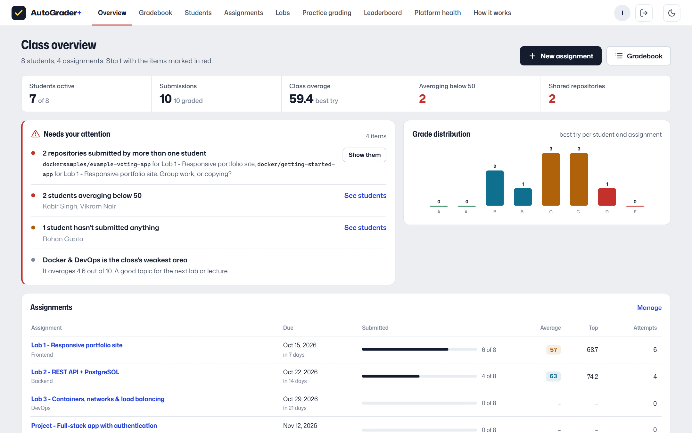

# AutoGrader+

**Your GitHub repository, marked like a code review.** Five AI reviewers check a full-stack project in parallel (code quality, architecture, security, testing, Docker & DevOps), a judge agent calibrates their scores, and the student gets a score, the exact files to fix and what to learn next, usually in about a minute. Around the grader sits a learning platform with separate views for students and instructors.

**Live:** https://autograder-plus.onrender.com &nbsp;·&nbsp; **How it works:** https://autograder-plus.onrender.com/how-it-works



## Try it

Open the live link and, on the sign-in page, choose **Student view** or **Instructor view**. The instructor demo is read-only: it can open every page but cannot change grades or assignments. The site runs on a free plan, so the first visit after a quiet period takes about a minute.

## What it does

**For students:** assignments with visible rubrics, live grading progress, feedback with marks by area and numbered fixes, score history and skills, XP and a leaderboard, and five hands-on labs (frontend, SQL, load balancers, networks, Docker).

**For instructors:** a class overview that starts with what needs attention (shared repositories, failed gradings, students below 50, students who haven't started), a gradebook, per-assignment analytics (distribution, median, spread, possible copying), student profiles, grade adjustment with a reason, re-grading, and CSV export.

**Under the hood:** a grading DAG with five parallel reviewers and a judge (2.74× faster than running the stages in sequence), a result cache (1.2 s re-grades), live progress over Server-Sent Events, stateless replicas behind Nginx with PostgreSQL, and a durable event log so any replica can stream any job.

## Run it locally

```bash
python -m venv .venv && .venv/bin/pip install -r requirements.txt     # Windows: .\scripts\start.ps1
.venv/bin/python -m uvicorn app.main:app --port 8000                   # http://localhost:8000
```

Demo accounts and sample assignments are created on first start (SQLite, no setup). For the full stack with a load balancer, three API replicas and PostgreSQL:

```bash
docker compose up --build            # http://localhost:8080
```

Without `ANTHROPIC_API_KEY` the reviewers use rule-based scorers through the same pipeline. Add the key to `.env` for LLM reviews.

## Documentation

| | |
|---|---|
| [How it works](https://autograder-plus.onrender.com/how-it-works) | Architecture, pipeline, scoring, latency (with live numbers), security, data model |
| [docs/ARCHITECTURE.md](docs/ARCHITECTURE.md) | Full design notes and trade-offs |
| [docs/AutoGrader-Report.pdf](docs/AutoGrader-Report.pdf) | Project report (20 pages, with screenshots) |
| [docs/AutoGrader.pptx](docs/AutoGrader.pptx) / [PDF](docs/AutoGrader-Slides.pdf) | Slides with speaker notes |
| `/docs` on any instance | Interactive API reference |

Rebuild the report and slides with `python docs/build_report.py` and `python docs/build_slides.py`. Measure the pipeline with `python scripts/latency_benchmark.py <repo-url>`, and verify access control with `scripts/security_check.py` (51 checks).

## Project layout

```
app/          FastAPI app: main.py (HTTP, SSE), jobs.py + pipeline.py (grading engine), agents/, ingest/, sandbox/, report/
app/platform/ accounts, assignments, dashboards, instructor analytics, labs, demo class (SQLite or PostgreSQL)
web/          single-page app, no build step
deploy/       Nginx load balancer config
docs/         design notes, report, slides and their generators
scripts/      local launcher, latency benchmark, security check, icon generator
```

## Deploy (free)

1. Create a free PostgreSQL database at [neon.com](https://neon.com) and copy its connection string.
2. Click [](https://render.com/deploy?repo=https://github.com/roshanraj9136/auto-grader) and fill in the database URL, an instructor email and password, and a class join code.
3. Every push to `main` redeploys automatically.

`AUTOGRADER_DEMO_SEED=1` (set in `render.yaml`) turns on the public demo: the demo logins and a sample class whose public repositories are graded by the real pipeline. Set it to `0` for a real class; that also removes the demo accounts.

## Main settings

| Variable | Purpose |
|---|---|
| `AUTOGRADER_DATABASE_URL` | PostgreSQL URL (SQLite in the work directory if unset) |
| `AUTOGRADER_INSTRUCTOR_EMAIL`, `_PASSWORD` | The real instructor account |
| `AUTOGRADER_SIGNUP_CODE` | Class join code students need to sign up |
| `AUTOGRADER_DEMO_SEED` | 1 = public demo accounts and sample class |
| `ANTHROPIC_API_KEY` | Turns on LLM reviewers |
| `AUTOGRADER_MAX_CONCURRENT_JOBS` | Gradings per replica at the same time |
| `AUTOGRADER_ENABLE_DOCKER` | 1 = build and run student Dockerfiles in the sandbox (use an isolated host) |
