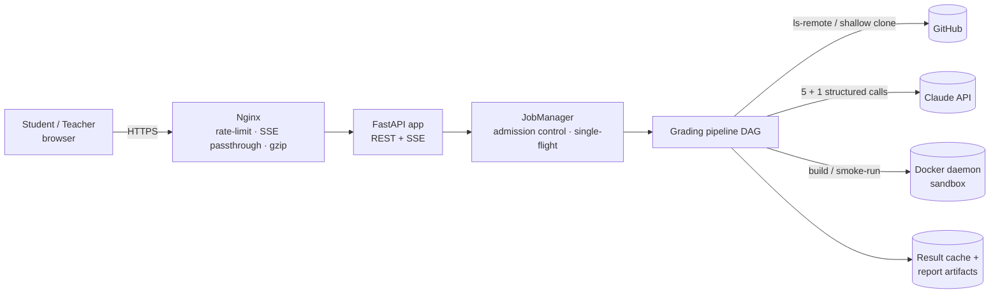
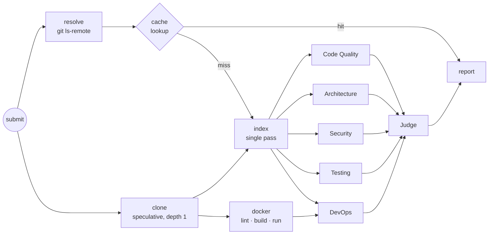

# AutoGrader — Architecture & Latency Design

AutoGrader grades a full-stack student project from a **GitHub URL + (optional) Dockerfile**.
Five specialist LLM agents assess separate dimensions in parallel. A judge agent then
cross-examines their reports, and the system returns a full report (HTML / Markdown / JSON).

## 1. Requirements that shaped the design

| # | Requirement | Design response |
|---|---|---|
| R1 | Low end-to-end latency | Parallel DAG, speculative clone, result cache, bounded prompts, model tiering |
| R2 | Bounded tail latency (p95/p99) | Per-agent and judge deadlines, SDK retries with backoff, heuristic fallback |
| R3 | Reproducible, explainable grades | Final score is computed in code from weights. The judge can move each dimension by ±1.5 at most and must give a rationale |
| R4 | Safe on untrusted input | GitHub-only URL allow-list, no shell, secrets redacted before any prompt, locked-down container run |
| R5 | Live feedback | Server-Sent Events stream every stage and agent event, with replay for late subscribers |
| R6 | Runs without an API key | Every agent has a deterministic heuristic scorer, so the same pipeline works offline |

## 2. System context



## 3. Layered component view

| Layer | Responsibility | Code |
|---|---|---|
| Presentation | Submit form, live DAG view, waterfall, embedded report, metrics | `web/` |
| API | Validation, auth guard, REST, SSE, artifact download | `app/main.py` |
| Application | Job lifecycle, concurrency limits, de-dup, DAG orchestration, tracing | `app/jobs.py`, `app/pipeline.py`, `app/tracing.py` |
| Domain (agents) | 5 specialists + judge, scoring contracts | `app/agents/` |
| Infrastructure | Git, repo indexing, context packing, Docker sandbox, LLM client, storage | `app/ingest/`, `app/sandbox/`, `app/agents/llm.py`, `app/report/` |
| Contracts | Typed models shared by all stages | `app/models.py` |

Dependencies point downward only. Agents never touch the filesystem, network, or Docker directly.
They read a shared, read-only **`RepoIndex`**, which acts as a blackboard built once in a single pass.

## 4. Multi-agent design

| Agent | Dimension | Evidence slice (selected from the index) |
|---|---|---|
| Code Quality | readability, size, duplication, linting | largest files + diverse sample across modules, duplication and comment metrics |
| Architecture | layering, coupling, API/DB design, scalability | entrypoints, routes/services/models, **module dependency graph + cycles**, compose/nginx/k8s |
| Security | OWASP Top 10 | secret-scanner and risky-pattern hits (leads to verify), auth-related files, `.gitignore` |
| Testing | unit, integration, e2e, CI | test files, test/source ratio, CI workflows, test scripts |
| DevOps & Docker | containerisation and delivery | Dockerfile, static lint (20+ rules), **real build/run result and logs**, compose, CI |
| **Judge** | final verdict | the five compact structured reports only, never raw code |

- **Structured output.** Every call uses forced tool use with a JSON schema, so there is no free-text parsing. Scores are clamped and validated in code.
- **Bounded judge.** The judge can recalibrate each dimension by ±1.5 and must explain the change. The overall score is computed as `Σ wᵢ·scoreᵢ` in code, which keeps it reproducible and auditable.
- **Graceful degradation.** If an LLM call errors or exceeds its deadline, that agent alone falls back to its heuristic scorer (`mode = heuristic-fallback`), and the report marks it.

## 5. Pipeline DAG and critical path



```
T_total ≈ max(T_resolve, T_clone) + max( T_index + max(T_agent1..4),  T_docker + T_devops ) + T_judge
T_seq   = Σ all stages            (what a naive sequential grader would cost)
```

Only the DevOps agent waits for Docker. The four code-reading agents start the moment indexing finishes (about 35 ms after the clone), so a slow `docker build` overlaps with LLM work. Every report includes a measured critical path, computed by walking back from `report` along the dependency that finished last. It also includes `speedup = T_seq / T_total`.

## 6. Latency engineering

| Technique | Where | Effect |
|---|---|---|
| Fan-out / fan-in of 5 agents | `pipeline.py` | The LLM phase costs the slowest agent's time instead of the sum of all five |
| Docker overlapped with code agents | `pipeline.py` | The build is removed from the critical path unless it is the longest branch |
| Speculative clone ‖ `ls-remote` | `pipeline.py`, `git_ops.py` | A cache miss pays nothing for resolution. On a hit the clone is cancelled and its process tree killed |
| Content-addressed result cache | `report/store.py` | Same commit + Dockerfile + rubric + models returns the stored report. Measured at 1.2 s, dominated by `ls-remote` |
| Single-flight de-duplication | `jobs.py` | An identical in-flight request attaches to the running job instead of re-running |
| Shallow, single-branch, tagless clone | `git_ops.py` | Transfers the minimum objects |
| One-pass indexer, scans done once | `indexer.py` | 35 ms for an 8-service repo. No agent re-reads disk |
| Relevance-ranked evidence with char budgets | `context.py`, `specialists.py` | About 3.6k–7.2k input tokens per agent, which keeps prefill and TTFT low |
| Prompt-cache-friendly layout | `llm.py` | `tools + system[0]` (preamble + shared repo context) is byte-identical across the 5 agents and carries the cache breakpoint |
| Capped output tokens + concise schema | `config.py`, `base.py` | Output decoding dominates LLM latency, so findings are capped at 7 and summaries kept short |
| Small judge input | `judge.py` | The only *sequential* LLM call reads about 1k tokens of structured reports |
| Model tiering | `AUTOGRADER_AGENT_MODEL` / `JUDGE_MODEL` | A fast model can serve the specialists and a stronger one the judge, or the reverse |
| Global LLM semaphore | `llm.py` | Bursts queue locally instead of triggering 429 retry storms |
| Non-blocking I/O | `proc.py` | git, docker and indexing run in worker threads, so the event loop keeps serving SSE |
| SSE progress | `main.py`, `web/app.js` | Users see each stage as it happens instead of waiting on a spinner |

### Measured / benchmarked (`scripts/latency_benchmark.py`, `dockersamples/example-voting-app`)

These figures use the real clone, index, lint, evidence and judge logic. LLM latency is **simulated** as
`TTFT 0.8 s + in/20k tok/s + out/70 tok/s`, so they show the speedup from the architecture, not Claude's own speed.

| Metric | Value |
|---|---|
| Wall-clock (5 agents + judge) | **27.5 s** |
| Same stages run sequentially | 75.5 s |
| Speed-up from the DAG | **2.74×** |
| Measured critical path | clone → index → agent:security → judge → report |
| Cache-hit regrade (real) | 1.2 s |
| Index (real) | 34–38 ms |
| Shared prompt prefix identical across 5 agents | yes (one SHA-256 hash) |

### Latency budget (worst case is bounded by construction)

| Stage | Typical | Hard limit |
|---|---|---|
| resolve ‖ clone | 0.8–2.5 s | `CLONE_TIMEOUT` 120 s |
| index | < 0.1 s | file / byte caps (5,000 files, 40 MB read) |
| specialist agent | 10–25 s | `AGENT_TIMEOUT` 120 s → heuristic fallback |
| docker build + smoke run | 20–300 s | `DOCKER_BUILD_TIMEOUT` 600 s + 8 s run |
| judge | 8–15 s | `JUDGE_TIMEOUT` 150 s → heuristic fallback |

`GET /api/metrics` returns rolling p50/p95/max per stage, so tail latency can be observed instead of guessed.

### Trade-offs taken deliberately

- **Parallelism vs. prompt-cache reuse.** Anthropic caches become readable only after the first request starts responding. Five *simultaneous* calls therefore each write the cache, and the reuse shows up on re-grades within the TTL. Staggering agents behind a warm-up call would lower cost but add roughly one TTFT to the critical path. Latency was chosen.
- **Judge sees reports, not code.** This makes the judge fast and cheap. It cannot find new issues, which is acceptable because its role is calibration and consistency.
- **Single API process per replica.** Job state and SSE fan-out live in memory. This is simple and fast. Replicas scale out behind sticky routing; see §9.

## 7. Reliability

- Timeouts on every external call: git, docker, each LLM call, the judge.
- The Anthropic SDK retries 429 and 5xx responses with exponential backoff (`LLM_MAX_RETRIES`).
- **Free tiers are chained, not retried.** Gemini and Groq are both OpenAI-compatible, so one client drives both. A call tries Gemini first; a 429 does not wait, it moves the same call to the next model and then to Groq, and remembers that model's cooldown (from the provider's `retry-after`, or 15 minutes when the message says a *daily* quota is gone) so later calls skip it instead of asking again. Only when every model is cooling does the call wait. The agent and judge deadlines still bound the total, and a specialist that runs out of time falls back to its rule-based scorer.
- Groq's free tier allows about 8,000 tokens per minute per model, so its five specialists are spread over `openai/gpt-oss-20b` and `openai/gpt-oss-120b`, and prompts sent there are shortened to ~12k characters. When Groq rejects a tool call over a small schema slip (`tool_use_failed`), the raw generation it returns is parsed leniently instead of spending another call. Model calls also send a named `User-Agent`: Groq's edge blocks Python's default one (error 1010).
- Measured: a 5-service repository reviewed in 18 s on Gemini, and 64-67 s on Groq alone, in both cases with all five specialists and the judge answered by models.
- Admission control: `MAX_CONCURRENT_JOBS` semaphore with FIFO waiting and a visible queue position.
- Failed or cancelled jobs cancel their background tasks (clone, docker build) and always delete the workspace. Orphans are purged on startup.
- Artifacts are written atomically (write to `.tmp`, then `os.replace`), and reports survive process restarts.

## 8. Security

- **Input.** Only `https://github.com/<owner>/<repo>` is accepted, which blocks `file://`, `ext::`, SSH and SSRF to other hosts. Refs are validated and cannot start with `-`, so they cannot be parsed as options. All subprocesses run with argument lists, never a shell. Git runs with credential prompts disabled.
- **Secrets.** Nine scanner rules run during indexing, and matched values are **redacted before any content reaches an LLM prompt or a report**.
- **Sandbox run.** Containers run with `--network none --memory 512m --cpus 1 --pids-limit 256 --cap-drop ALL --security-opt no-new-privileges`, and images and containers are removed afterwards.
- **Known risk.** `docker build` executes arbitrary RUN steps with network access. The sandbox is therefore **opt-in** (`docker-compose.sandbox.yml`) and intended for a dedicated VM or rootless Docker.
- **Access.** The optional bearer token (`AUTOGRADER_API_TOKEN`) is compared in constant time. Nginx rate-limits submissions to 6/min/IP. Without a token the API is open, so set one before exposing it beyond localhost.

## 9. Scaling and the v2 platform

v2 runs **N stateless API replicas behind Nginx** (docker compose, 3 by default, `--scale api=N`):

- **Shared state lives in PostgreSQL**: users, sessions, assignments, submissions (scores, dimension scores, learning path), lab progress and replica heartbeats. Reports and the result cache sit on a shared volume, so any replica can serve any page or report.
- **Live state is also durable.** A grading job runs in the replica that accepted it and fans its events out in memory. Every event is also appended, in order, to the `job_events` table by one writer task per replica (batched, one transaction per batch). A replica that does not hold the job streams it from that table instead, so **any replica can serve any job's live progress** and sticky routing is no longer required (Nginx still uses it, which keeps streams on the fast in-memory path). If the replica running a job dies, the stream ends with the saved outcome once peers mark the submission failed. Events are pruned after three days; the finished report lives in `report_artifacts`.
- **Job listeners.** `JobManager` notifies a listener on every running/done/failed transition *before* publishing the terminal SSE event. That listener mirrors the state into the `submissions` table, so a dashboard that refreshes on `job_done` already sees the grade.
- **Failure handling.**
  - Every replica writes a heartbeat to `instances` every 20 s.
  - Any replica fails the unfinished submissions of replicas that stopped heart-beating (crash, scale-down, recreated container), deletes their orphaned clone directories, and repairs its own rows if a listener update was lost.
  - On shutdown, a replica fails its own in-flight submissions.
- **Per-replica isolation on the shared volume.** In-flight clones go to `jobs/<instance-id>/`. Artifacts use unique temp files plus atomic rename. Finished reports are also copied into the `report_artifacts` table and served from there when the file is missing, so they survive hosts with an ephemeral disk (e.g. Render's free plan) and replicas without a shared volume.
- **Database pool.** At most 10 connections per replica. Idle connections are pinged before reuse, and DDL plus seeding is serialised with a Postgres advisory lock so replicas can start together.

Next steps at course scale are in §13.

## 10. Learning platform layer

`app/platform/` sits on top of the grading engine without changing its contracts:

| Module | Responsibility |
|---|---|
| `db.py` | Portable SQL over DB-API: SQLite (default) or PostgreSQL. `?` placeholders are rewritten for psycopg; there is no ORM |
| `security.py` | scrypt password hashes, SHA-256-stored session tokens, HttpOnly cookies, role dependencies |
| `api.py` | Auth, assignments (rubric weights + brief become the grading rubric), dashboards, leaderboard (XP), instructor analytics, CSV gradebook (formula-injection safe) |
| `labs.py` | Lab catalogue + progress. The SQL lab is server-verified against reference answers on a sandboxed in-memory DB. The Dockerfile lab reuses the DevOps linter. The load-balancer and network endpoints expose replica identity, proxy headers and `Server-Timing` |
| `seed.py` | Optional demo accounts and four sample assignments (frontend, backend + DB, containers/networks/LB, full-stack) |

Only **server-verified** lab tasks earn XP, so the leaderboard cannot be inflated with forged browser calls. Self-checked tasks still count as progress. The labs are deliberately *not* simulations: the load-balancer lab sends real requests through the platform's own Nginx to its replicas, and the network lab breaks a request down with the Resource Timing API plus the backend's `Server-Timing` header.

This matches the proposed next version of the course Autograder: a platform that **teaches full-stack development**, with containerised backends reached through web and mobile (PWA) clients, and AutoGrader's report (with its *learning path* section) as the feedback loop.

## 11. Instructor workspace

`app/platform/instructor.py` serves the instructor's deep views; every route requires the instructor role.

| Route | What it returns |
|---|---|
| `GET /api/instructor/gradebook` | Students × assignments: best graded attempt per cell, attempts, late flag (best attempt after the deadline), adjusted flag; per-column mean, count and maximum |
| `GET /api/instructor/assignments/{id}` | Mean, median, population standard deviation, range, students below 50, late attempts, a 10-band histogram, letter-grade counts, per-area averages over best attempts, attempts per day, students who have not submitted, possible copying, and each student's best and latest attempt |
| `GET /api/instructor/students/{id}` | One student's numbers, skill profile (last 10 graded), score timeline, per-assignment best and attempts, every submission, lab progress |
| `POST / DELETE /api/instructor/submissions/{id}/override` | Set a graded submission's score with a mandatory reason, or restore the original |
| `POST /api/instructor/submissions/{id}/regrade` | Grade a submission again from scratch (same repository and ref, current rubric) as a new attempt |
| `POST /api/instructor/assignments/{id}/regrade` | Re-run every student's latest submission with the current rubric; unchanged code and rubric hit the cache |

- **Possible copying** has two signals: the same repository URL used by two or more students for one assignment, and the same commit SHA appearing in *different* repositories (an unchanged fork). Both are hints for a human to review, not verdicts.
- **Grade adjustments** write the new score into the submission row and *pin* the assignment grade: wherever a best attempt is chosen, an adjusted submission wins over every other attempt, including later ones. The original score and grade, the reason, the instructor and the time are kept in `grade_overrides`; `on_job_event` skips adjusted rows so a replayed job state cannot overwrite an adjustment; students see the reason on their feedback page.
- **The overview** computes its "needs attention" list in the browser from the overview and student endpoints: shared repositories, failed gradings, students averaging below 50, students with no submissions, deadlines within 7 days with under 60% completion, and the weakest area when it averages below 6/10.

## 12. Platform security

| Concern | Control |
|---|---|
| Role checks | Every instructor route depends on `require_instructor`; writes (assignments, adjustments, re-grades) on `require_instructor_write`, which also rejects public demo accounts. Signup always creates a student. |
| Data isolation | Students read only their own submissions; reports and live streams (including the database-backed stream) go through `require_job_access`: owner, instructor or API token. |
| Public demo | With `AUTOGRADER_DEMO_SEED=1`, only a demo *student* login is public; there is no public instructor login (the old one is deleted at start-up). Sign-up is closed, demo logins cannot change their name or password, and any demo account is refused every instructor write and never sees real students' emails. Addresses under `autograder.local` are reserved. |
| Brute force | Failed sign-ins are throttled per client IP (10 per 15 min) and per account (100 per 15 min, so a stranger cannot lock the instructor out with a few guesses); wrong join codes per IP (8 per hour) and in total (200 per hour); the join code is compared in constant time. Counters are per replica and in memory. |
| Client address | Throttles key on an address the client cannot forge: the edge proxy's header (`AUTOGRADER_CLIENT_IP_HEADER`: `cf-connecting-ip` on Render, which sits behind Cloudflare; `x-real-ip` behind the bundled Nginx), otherwise the right-most `X-Forwarded-For` hop. Never the left-most hop, which the client writes. |
| Grade integrity | An adjusted grade is pinned: it replaces the student's best attempt for that assignment in every view (dashboard, gradebook, analytics, leaderboard, CSV), including attempts submitted later, until the instructor restores it. Re-running is refused when the original inputs are not stored (practice runs with a custom rubric, uploaded Dockerfiles). |
| Browser | HttpOnly + SameSite=Lax + Secure cookies, Fetch-Metadata / Origin check on state-changing API calls, strict CSP, HSTS over HTTPS, `X-Frame-Options`, `Permissions-Policy`, `nosniff`. All user data is HTML-escaped before rendering. |
| Verification | `scripts/security_check.py` runs its checks against a demo-mode server as a visitor, the demo student and the real instructor. |

## 13. Scaling roadmap

What exists today scales horizontally for the web tier: replicas are stateless, PostgreSQL holds all shared state, and the durable event log lets any replica stream any job. Grading capacity grows with the number of replicas (`MAX_CONCURRENT_JOBS` each). The steps below follow how large course autograders are built, ordered by value:

1. **A durable work queue in PostgreSQL.** Insert a `grading_jobs` row per request and let workers claim rows with `UPDATE … WHERE id = (SELECT id … FOR UPDATE SKIP LOCKED LIMIT 1)`. `SKIP LOCKED` lets many workers drain one table without blocking each other, needs no new infrastructure, and makes jobs survive restarts (a free host going to sleep would resume, not fail). `LISTEN/NOTIFY` can wake workers, with polling as the fallback. Autolab's grader (Tango) uses the same split between a job queue and a job manager that assigns jobs to free workers; the University at Buffalo runs it for 2,000+ daily submissions across six grading servers.
2. **Separate web and worker roles.** The same image started as `web` (HTTP + streams) or `worker` (claims and runs jobs), scaled independently: many small web replicas, fewer large workers with Docker.
3. **Isolated build workers.** Run student Dockerfile builds on dedicated hosts (BuildKit, or Kubernetes Jobs with gVisor/Kata), one fresh environment per submission, as Autolab and Gradescope do.
4. **Object storage for reports** (S3 or MinIO) once the report table grows large; keep only metadata in PostgreSQL.
5. **Per-area retries.** Re-run one reviewer that failed instead of the whole job.
6. **Courses.** Add a `courses` table and scope assignments, enrolments and analytics to a course, so one deployment serves many classes.
7. **Shared rate limits** in Redis when there are many replicas, so throttles are global rather than per replica.

The PostgreSQL queue is sound up to a few thousand jobs per second, far beyond a course's needs; beyond that the queue would move to a dedicated broker.
