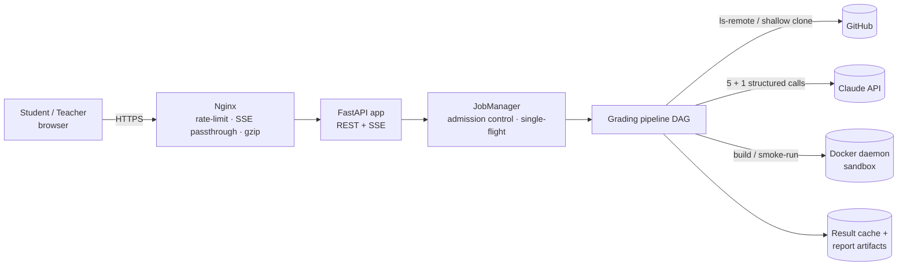
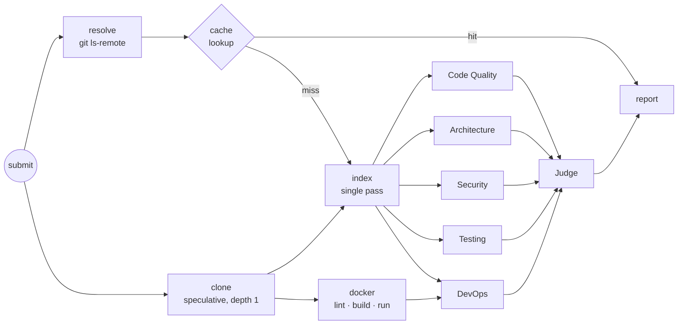

# AutoGrader — Architecture & Latency Design

AutoGrader grades a full-stack student project from a **GitHub URL + (optional) Dockerfile**.
Five specialist LLM agents assess separate dimensions in parallel. A judge agent then
cross-examines their reports, and the system returns a full report (HTML / Markdown / JSON).

## 1. Requirements that shaped the design

| # | Requirement | Design response |
|---|---|---|
| R1 | Low end-to-end latency | Parallel DAG, speculative clone, result cache, bounded prompts, model tiering |
| R2 | Bounded tail latency (p95/p99) | Per-agent and judge deadlines, SDK retries with backoff, heuristic fallback |
| R3 | Reproducible, explainable grades | Final score is computed in code from weights. The judge can move each dimension by ±1.5 at most and must give a rationale |
| R4 | Safe on untrusted input | GitHub-only URL allow-list, no shell, secrets redacted before any prompt, locked-down container run |
| R5 | Live feedback | Server-Sent Events stream every stage and agent event, with replay for late subscribers |
| R6 | Runs without an API key | Every agent has a deterministic heuristic scorer, so the same pipeline works offline |

## 2. System context



## 3. Layered component view

| Layer | Responsibility | Code |
|---|---|---|
| Presentation | Submit form, live DAG view, waterfall, embedded report, metrics | `web/` |
| API | Validation, auth guard, REST, SSE, artifact download | `app/main.py` |
| Application | Job lifecycle, concurrency limits, de-dup, DAG orchestration, tracing | `app/jobs.py`, `app/pipeline.py`, `app/tracing.py` |
| Domain (agents) | 5 specialists + judge, scoring contracts | `app/agents/` |
| Infrastructure | Git, repo indexing, context packing, Docker sandbox, LLM client, storage | `app/ingest/`, `app/sandbox/`, `app/agents/llm.py`, `app/report/` |
| Contracts | Typed models shared by all stages | `app/models.py` |

Dependencies point downward only. Agents never touch the filesystem, network, or Docker directly.
They read a shared, read-only **`RepoIndex`**, which acts as a blackboard built once in a single pass.

## 4. Multi-agent design

| Agent | Dimension | Evidence slice (selected from the index) |
|---|---|---|
| Code Quality | readability, size, duplication, linting | largest files + diverse sample across modules, duplication and comment metrics |
| Architecture | layering, coupling, API/DB design, scalability | entrypoints, routes/services/models, **module dependency graph + cycles**, compose/nginx/k8s |
| Security | OWASP Top 10 | secret-scanner and risky-pattern hits (leads to verify), auth-related files, `.gitignore` |
| Testing | unit, integration, e2e, CI | test files, test/source ratio, CI workflows, test scripts |
| DevOps & Docker | containerisation and delivery | Dockerfile, static lint (20+ rules), **real build/run result and logs**, compose, CI |
| **Judge** | final verdict | the five compact structured reports only, never raw code |

- **Structured output.** Every call uses forced tool use with a JSON schema, so there is no free-text parsing. Scores are clamped and validated in code.
- **Bounded judge.** The judge can recalibrate each dimension by ±1.5 and must explain the change. The overall score is computed as `Σ wᵢ·scoreᵢ` in code, which keeps it reproducible and auditable.
- **Graceful degradation.** If an LLM call errors or exceeds its deadline, that agent alone falls back to its heuristic scorer (`mode = heuristic-fallback`), and the report marks it.

## 5. Pipeline DAG and critical path



```
T_total ≈ max(T_resolve, T_clone) + max( T_index + max(T_agent1..4),  T_docker + T_devops ) + T_judge
T_seq   = Σ all stages            (what a naive sequential grader would cost)
```

Only the DevOps agent waits for Docker. The four code-reading agents start the moment indexing finishes (about 35 ms after the clone), so a slow `docker build` overlaps with LLM work. Every report includes a measured critical path, computed by walking back from `report` along the dependency that finished last. It also includes `speedup = T_seq / T_total`.

## 6. Latency engineering

| Technique | Where | Effect |
|---|---|---|
| Fan-out / fan-in of 5 agents | `pipeline.py` | The LLM phase costs the slowest agent's time instead of the sum of all five |
| Docker overlapped with code agents | `pipeline.py` | The build is removed from the critical path unless it is the longest branch |
| Speculative clone ‖ `ls-remote` | `pipeline.py`, `git_ops.py` | A cache miss pays nothing for resolution. On a hit the clone is cancelled and its process tree killed |
| Content-addressed result cache | `report/store.py` | Same commit + Dockerfile + rubric + models returns the stored report. Measured at 1.2 s, dominated by `ls-remote` |
| Single-flight de-duplication | `jobs.py` | An identical in-flight request attaches to the running job instead of re-running |
| Shallow, single-branch, tagless clone | `git_ops.py` | Transfers the minimum objects |
| One-pass indexer, scans done once | `indexer.py` | 35 ms for an 8-service repo. No agent re-reads disk |
| Relevance-ranked evidence with char budgets | `context.py`, `specialists.py` | About 3.6k–7.2k input tokens per agent, which keeps prefill and TTFT low |
| Prompt-cache-friendly layout | `llm.py` | `tools + system[0]` (preamble + shared repo context) is byte-identical across the 5 agents and carries the cache breakpoint |
| Capped output tokens + concise schema | `config.py`, `base.py` | Output decoding dominates LLM latency, so findings are capped at 7 and summaries kept short |
| Small judge input | `judge.py` | The only *sequential* LLM call reads about 1k tokens of structured reports |
| Model tiering | `AUTOGRADER_AGENT_MODEL` / `JUDGE_MODEL` | A fast model can serve the specialists and a stronger one the judge, or the reverse |
| Global LLM semaphore | `llm.py` | Bursts queue locally instead of triggering 429 retry storms |
| Non-blocking I/O | `proc.py` | git, docker and indexing run in worker threads, so the event loop keeps serving SSE |
| SSE progress | `main.py`, `web/app.js` | Users see each stage as it happens instead of waiting on a spinner |

### Measured / benchmarked (`scripts/latency_benchmark.py`, `dockersamples/example-voting-app`)

These figures use the real clone, index, lint, evidence and judge logic. LLM latency is **simulated** as
`TTFT 0.8 s + in/20k tok/s + out/70 tok/s`, so they show the speedup from the architecture, not Claude's own speed.

| Metric | Value |
|---|---|
| Wall-clock (5 agents + judge) | **27.5 s** |
| Same stages run sequentially | 75.5 s |
| Speed-up from the DAG | **2.74×** |
| Measured critical path | clone → index → agent:security → judge → report |
| Cache-hit regrade (real) | 1.2 s |
| Index (real) | 34–38 ms |
| Shared prompt prefix identical across 5 agents | yes (one SHA-256 hash) |

### Latency budget (worst case is bounded by construction)

| Stage | Typical | Hard limit |
|---|---|---|
| resolve ‖ clone | 0.8–2.5 s | `CLONE_TIMEOUT` 120 s |
| index | < 0.1 s | file / byte caps (5,000 files, 40 MB read) |
| specialist agent | 10–25 s | `AGENT_TIMEOUT` 120 s → heuristic fallback |
| docker build + smoke run | 20–300 s | `DOCKER_BUILD_TIMEOUT` 600 s + 8 s run |
| judge | 8–15 s | `JUDGE_TIMEOUT` 150 s → heuristic fallback |

`GET /api/metrics` returns rolling p50/p95/max per stage, so tail latency can be observed instead of guessed.

### Trade-offs taken deliberately

- **Parallelism vs. prompt-cache reuse.** Anthropic caches become readable only after the first request starts responding. Five *simultaneous* calls therefore each write the cache, and the reuse shows up on re-grades within the TTL. Staggering agents behind a warm-up call would lower cost but add roughly one TTFT to the critical path. Latency was chosen.
- **Judge sees reports, not code.** This makes the judge fast and cheap. It cannot find new issues, which is acceptable because its role is calibration and consistency.
- **Single API process.** Job state and SSE fan-out live in memory. This is simple and fast, but it is a scaling limit (see §9).

## 7. Reliability

- Timeouts on every external call: git, docker, each LLM call, the judge.
- The Anthropic SDK retries 429 and 5xx responses with exponential backoff (`LLM_MAX_RETRIES`).
- Admission control: `MAX_CONCURRENT_JOBS` semaphore with FIFO waiting and a visible queue position.
- Failed or cancelled jobs cancel their background tasks (clone, docker build) and always delete the workspace. Orphans are purged on startup.
- Artifacts are written atomically (write to `.tmp`, then `os.replace`), and reports survive process restarts.

## 8. Security

- **Input.** Only `https://github.com/<owner>/<repo>` is accepted, which blocks `file://`, `ext::`, SSH and SSRF to other hosts. Refs are validated and cannot start with `-`, so they cannot be parsed as options. All subprocesses run with argument lists, never a shell. Git runs with credential prompts disabled.
- **Secrets.** Nine scanner rules run during indexing, and matched values are **redacted before any content reaches an LLM prompt or a report**.
- **Sandbox run.** Containers run with `--network none --memory 512m --cpus 1 --pids-limit 256 --cap-drop ALL --security-opt no-new-privileges`, and images and containers are removed afterwards.
- **Known risk.** `docker build` executes arbitrary RUN steps with network access. The sandbox is therefore **opt-in** (`docker-compose.sandbox.yml`) and intended for a dedicated VM or rootless Docker.
- **Access.** The optional bearer token (`AUTOGRADER_API_TOKEN`) is compared in constant time. Nginx rate-limits submissions to 6/min/IP. Without a token the API is open, so set one before exposing it beyond localhost.

## 9. Scaling roadmap

The current deployment is one API process behind Nginx, which suits a class of a few hundred students. The path to horizontal scale:

1. Move job state and the event bus to **Redis** (streams or pub/sub) and run pipelines in **worker processes** fed by a queue. The API then becomes stateless and can run N replicas behind the load balancer.
2. Store reports in object storage (S3/MinIO) and job history in PostgreSQL.
3. Run Docker builds on dedicated BuildKit workers or Kubernetes Jobs with gVisor/Kata isolation, with layer caches shared per course.
4. Grade at the agent level across workers, retrying a single dimension without re-running the whole job.

This matches the proposed next version of the course Autograder, a platform that **teaches full-stack development**. Containerised backends reached through web and mobile apps would let students practise load balancers, networks and databases in one place, and AutoGrader's report (with its *learning path* section) becomes the feedback loop.
